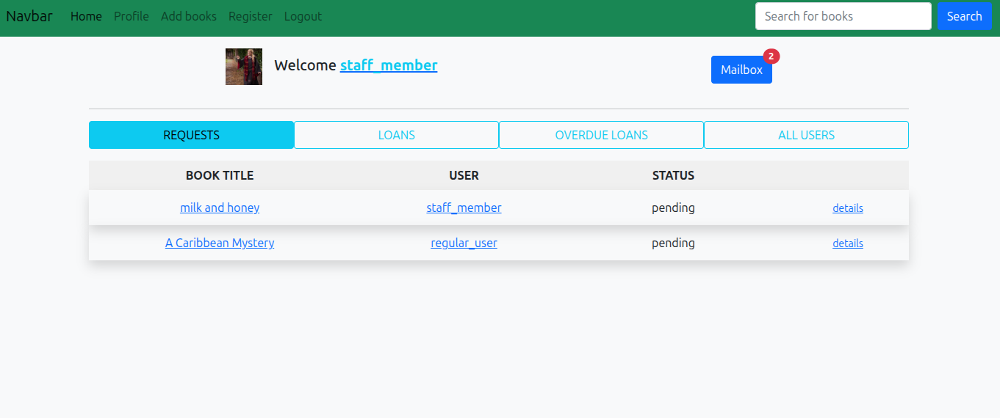

# Library Management System (CS50W Capstone)

## 📊 Project Overview
This project was developed as the Final Capstone Project for Harvard's **CS50’s Web Programming with Python and JavaScript**. It is a comprehensive library and book management system designed to handle different levels of user access, book borrowings, reviews, and administrative tasks.

The application uses **Django** on the backend and features an integrated email system, automated fee calculations, and a fully functional dashboard for staff members.

---

## 📜 Project Requirements
The project was built to satisfy the final capstone requirements of the CS50W curriculum, which demands a distinct, sufficiently complex project entirely designed and implemented by the student.

* **Full Specification:** [CS50W Final Project: Capstone](https://cs50.harvard.edu/web/2020/projects/final/capstone/)

---

## 🛠️ Tech Stack
* **Backend:** Python 3, Django
* **Database:** Django ORM
* **Frontend:** JavaScript, HTML5, CSS3, Bootstrap
* **Hosting:** Render

---

### 🖼️ Project Preview
*A look at the application's interface where users can browse books and manage their accounts.*

---

## 🚀 Features Included

The application is structured around three main user roles, each with specific permissions:

* **Unlogged Users:**
  * Search the database for books.
  * View detailed information about specific books.
  * Read book reviews left by other users.

* **Logged-in Users (Regular):**
  * Full authentication system (Login / Logout / Change Password).
  * Borrow and renew books.
  * View currently borrowed books and full borrowing history.
  * Write and publish reviews for books.
  * View profile details.
  * Internal communication: Send, compose, and receive emails.

* **Staff Members (Admin):**
  * Have all the permissions of a Regular User (including borrowing books).
  * **Main Dashboard:** Instantly view user book requests, all currently lent books, and overdue books.
  * **User Management:** Register new users, update or delete user accounts (including their own), and filter all user accounts.
  * **Book Management:** Accept or reject user borrowing requests, and process book returns.
  * **Fee System:** The application automatically calculates overdue fees. Staff members are responsible for confirming when a user has paid their fees.

---

## 🌐 How to Access the Application

The application is currently deployed and live. You do not need to install it locally to test its features.

1.  **Visit the Live App:**
    
    Go to: [https://c-s-5-0-w.onrender.com](https://c-s-5-0-w.onrender.com)

2.  **Test Accounts:**
    You can log in using the following pre-configured accounts to test different permission levels:

    * **Staff Account:** `Login: staff_member` 
      `Password: Password321`

    * **Regular User Account:** `Login: regular_user` 
      `Password: Password321`

3.  **Important Notice:**
    
    *Please do not change the passwords or delete these test accounts, so others can evaluate the project.*

---
*Created by **jposluszny** as part of the CS50W curriculum.*