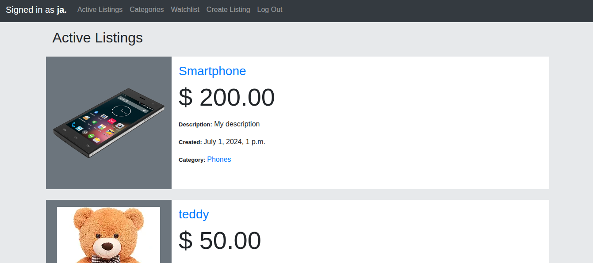

# Auctions (eBay Clone)

## 📊 Project Overview
This project was developed as part of Harvard's **CS50’s Web Programming with Python and JavaScript**. The goal was to build an auction-based e-commerce site where users can post listings, place bids, and interact with other users through comments and watchlists.

The application is built using the **Django** framework and focuses on back-end logic, database design (models), and user authentication.

---

## 📜 Project Requirements
The project was built strictly according to the official Harvard CS50W curriculum specifications:

* **Full Specification:** [CS50W Project 2: Commerce](https://cs50.harvard.edu/web/2020/projects/2/commerce/)

---

## 🛠️ Tech Stack
* **Backend:** Python 3, Django
* **Database:** SQLite / Django ORM
* **Frontend:** HTML5, CSS3, Bootstrap
* **DevOps:** Docker

---

### 🖼️ Project Preview
*A look at the custom interface where users can perform live Google searches.*

---

## 🚀 Features Included
* **Create Listing:** Users can post new auction items with a title, description, starting bid, and category.
* **Active Listings Page:** A dynamic feed showing all currently available auctions.
* **Bidding System:** Functional bidding logic that ensures new bids are higher than current ones.
* **Watchlist:** Ability for users to "follow" specific auctions and manage them in a dedicated view.
* **Categories:** Organized navigation to filter listings by their specific category.
* **Comments:** A feedback system allowing registered users to leave comments on listing pages.
* **Django Admin Interface:** Full administrative control over all site data (listings, bids, comments).

---

## 📁 How to Run Locally (Linux)

1.  **Clone the entire CS50W repository:**

    Clone the entire CS50W repository:
   `git clone https://github.com/jposluszny/C.S.5.0.W.git`

2.  **Navigate to this project's directory:**

    `cd C.S.5.0.W/Commerce`

3.  **Build the Docker image:**
    *Ensure you have Docker installed and running.*

    `sudo docker build -t commerce .`

4.  **Run the Docker container:**

    `sudo docker run -it -p 8000:8000 commerce`
 

5.  **Accessing the application:**
    Open your browser and go to: [http://localhost:8000/](http://localhost:8000/)

---
*Created by **jposluszny** as part of the CS50W curriculum.*