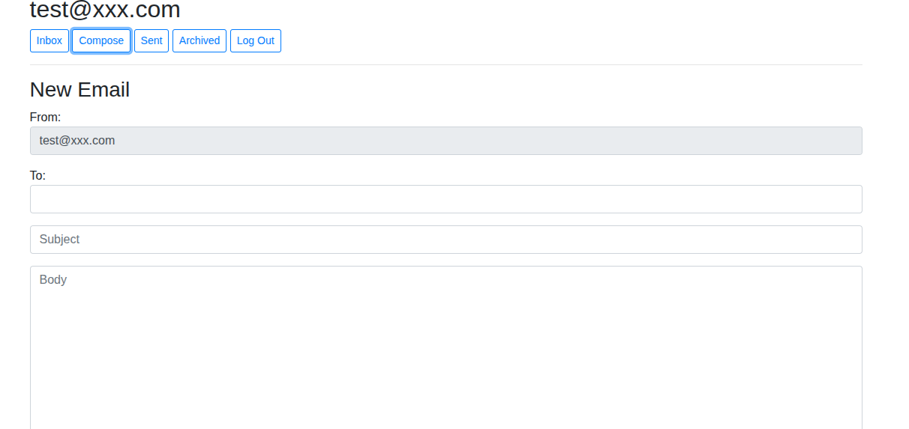

# Mail (Single-Page Email Client)

## 📊 Project Overview
This project was developed as part of Harvard's **CS50’s Web Programming with Python and JavaScript**. The goal was to design a front-end for an email client that makes API calls to send and receive emails. 

The application uses **Django** as the backend to handle the database and API routes, while the front-end is built entirely with **Vanilla JavaScript** to create a dynamic, Single-Page Application (SPA) experience without reloading the page.

---

## 📜 Project Requirements
The project was built strictly according to the official Harvard CS50W curriculum specifications:

* **Full Specification:** [CS50W Project 3: Mail](https://cs50.harvard.edu/web/2020/projects/3/mail/)

---

## 🛠️ Tech Stack
* **Backend:** Python 3, Django
* **Database:** SQLite / Django ORM
* **Frontend:** Vanilla JavaScript, HTML5, CSS3, Bootstrap
* **DevOps:** Docker

---

### 🖼️ Project Preview
*A look at the custom interface where users can manage their inbox, compose, and read emails.*

---

## 🚀 Features Included
* **Send Mail:** Users can compose and send new emails to other registered users.
* **Mailboxes:** A dynamic view allowing users to switch seamlessly between their "Inbox", "Sent", and "Archive" mailboxes.
* **View Email:** Clicking on an email reveals its full content, including sender, recipient, subject, timestamp, and body. Unread emails appear with a different background color than read emails.
* **Archive / Unarchive:** Users can easily move emails in and out of their archive folder to keep their main inbox clean.
* **Reply:** A dedicated reply button pre-fills the composition form with the original sender, subject (adding "Re:"), and the previous email's body for quick responses.

---

## 📁 How to Run Locally (Linux)

1.  **Clone the entire CS50W repository:**

    Clone the entire CS50W repository:
   `git clone https://github.com/jposluszny/C.S.5.0.W.git`

2.  **Navigate to this project's directory:**

    `cd C.S.5.0.W/Mail`

3.  **Build the Docker image:**
    *Ensure you have Docker installed and running.*

    `sudo docker build -t mail .`

4.  **Run the Docker container:**

    `sudo docker run -it -p 8000:8000 mail`
 

5.  **Accessing the application:**
    Open your browser and go to: [http://0.0.0.0:8000/](http://0.0.0.0:8000/)

---
*Created by **jposluszny** as part of the CS50W curriculum.*