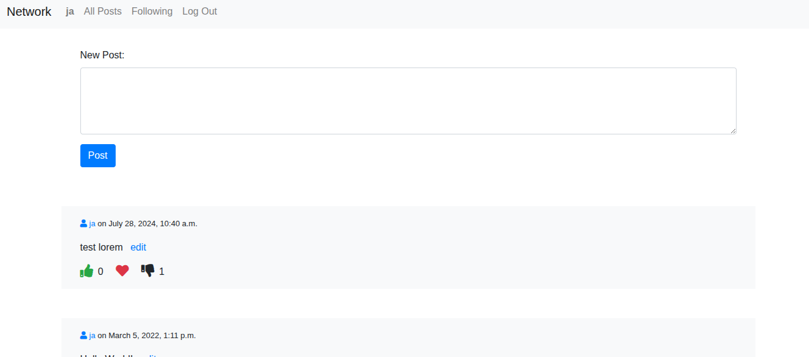

# CS50W Network: Social Network App

### 📊 Project Overview
This project was developed as part of Harvard's CS50W course to demonstrate advanced proficiency in **Full-Stack Web Development**, specifically focusing on asynchronous features and single-page application (SPA) behavior. **Network** is a social media platform that allows users to make posts, follow friends, and interact with content in real-time.

Key features include dynamic "Like" functionality, a follower system with filtered feeds, and in-place post editing—all implemented using **Django** and **JavaScript** to ensure a smooth, modern user experience without full page reloads.

### 🛠️ Tech Stack
* **Backend:** Django (Python Web Framework)
* **Frontend:** JavaScript (ES6+), HTML5, CSS3 (Bootstrap)
* **API/Communication:** JSON & Fetch API for asynchronous updates
* **Deployment/Containerization:** Docker
* **Version Control:** Git & GitHub

### 🖼️ Web App Preview
*Quick look at the social feed where users can interact, follow others, and manage their posts.*

### 🚀 How to Run Locally (Linux)
**Prerequisites:**
**Docker** installed and running on your machine.

1. Clone the repo: `git clone https://github.com/jposluszny/C.S.5.0.W.git`
2. Navigate to the project directory: `cd C.S.5.0.W/Network`
3. **Build the Docker image:** Run the following command:
   `sudo docker build -t network .`
4. **Run the container:** Start the application by running:
   `sudo docker run -it -p 8000:8000 network`
5. **Access the application:** Open your web browser and navigate to:
   `http://0.0.0.0:8000/`

### 🔗 Resources
* [**📜 CS50W Project 4: Network (Specification)**](https://cs50.harvard.edu/web/2020/projects/4/network/) – Official project specifications and requirements.

---
*Created by **jposluszny** as part of Harvard's CS50W training path.*