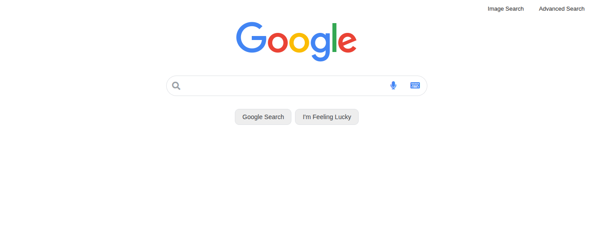

# Google Search Front-end Clone

### 📊 Project Overview
This project was developed as part of **Harvard's CS50’s Web Programming with Python and JavaScript**. The goal was to design a front-end for Google Search, Google Image Search, and Google Advanced Search, ensuring they function and look as close to the real Google pages as possible.

The application allows users to perform actual searches on Google directly from this custom interface by utilizing Google's query parameters.

### 📜 Project Requirements
The project was built strictly according to the official Harvard CS50W curriculum specifications:
* **Full Specification:** [CS50W Project 0: Search](https://cs50.harvard.edu/web/projects/0/search/)

### 🛠️ Tech Stack
* **Languages:** HTML5, CSS3
* **Design Philosophy:** Responsive Web Design, Google Material Design aesthetic
* **Features:** Google Query Integration (GET requests), Hover effects, Advanced search filtering

### 🖼️ Project Preview
*A look at the custom interface where users can perform live Google searches.*

### 🚀 Features Included
* **Main Search:** Functional search bar with "Google Search" and "I'm Feeling Lucky" buttons.
* **Image Search:** Dedicated page to query Google Images directly.
* **Advanced Search:** A complex form mimicking Google's advanced options (all these words, exact phrase, etc.).
* **Navigation:** Seamless transitions between the search types via a navigation menu.

### 📁 How to Run Locally
1. Clone the entire CS50W repository:
   `git clone https://github.com/jposluszny/C.S.5.0.W.git`
2. Navigate to this project's directory:
   `cd C.S.5.0.W/Search`
3. Open `index.html` in your favorite web browser.

---
*Created by **jposluszny** as part of the CS50W curriculum.*