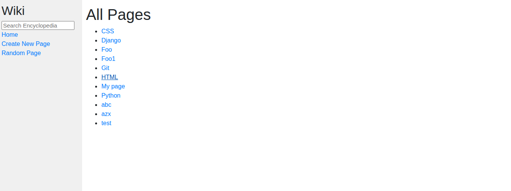

# CS50W Wiki: Online Encyclopedia

### 📊 Project Overview
This project was created to demonstrate proficiency in **Web Development with Python and Django** as part of Harvard's CS50W (Web Programming with Python and JavaScript) course. The primary focus was on building a Wikipedia-like online encyclopedia that allows users to create, view, search, and edit entries.

The application handles routing, dynamic content rendering, and utilizes a Markdown-to-HTML conversion process, allowing users to write encyclopedia entries in standard Markdown format which are then seamlessly displayed as stylized HTML pages.

### 🛠️ Tech Stack
* **Framework:** Django (Python Web Framework)
* **Frontend:** HTML5, CSS3
* **Data Processing:** Python `markdown2` (or similar library) for Markdown-to-HTML conversion
* **Deployment/Containerization:** Docker
* **Version Control:** Git & GitHub

### 🖼️ Web App Preview
*Quick look at the web interface where users can browse, read, search, and edit encyclopedia entries.*

### 🚀 How to Run Locally (Linux)
**Prerequisites:**
**Docker** installed and running on your machine.
1. Clone the repo: `git clone https://github.com/jposluszny/C.S.5.0.W.git`
2. Navigate to the project directory: `cd C.S.5.0.W/Wiki`
3. **Build the Docker image:** Run the following command in the project directory:
   `sudo docker build -t wiki .`
4. **Run the container:** Start the application by running:
   `sudo docker run -it -p 8000:8000 wiki`
5. **Access the application:** Open your web browser and navigate to:
   `http://0.0.0.0:8000/`

### 🔗 Resources
* [**📜 CS50W Project 1: Wiki (Specification)**](https://cs50.harvard.edu/web/2020/projects/1/wiki/) – Official project specifications and requirements.

---
*Created by **jposluszny** as part of Harvard's CS50W training path.*